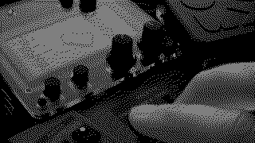
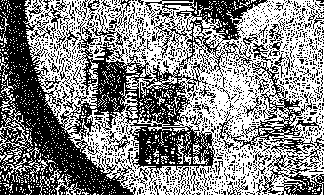

# Fixed filter banking crisis

This is about controlling flows, about volatility, and about living with the risk of explosion.

Eight bands and resonance.



## Requirements

- norns

## Usage

Each band has an attenuverter with 1.5 amplification.

Use <kbd>E1</kbd>, <kbd>E2</kbd> and <kbd>E3</kbd> to adjust the bands. More fun, map the parameters to some MIDI controller or use the TouchOSC control surface in this repo.



crow <kbd>input 1</kbd> selects one of the bands in ascending order with positive voltage, or *rq* with negative voltage. It is set to what <kbd>input 2</kbd> when a selection is made.

Use grid to control the band amplitudes.

This script can also work as an effect using the [fx mod](https://llllllll.co/t/fx-mod/62726) framework. A separate TouchOSC control surface is provided.

## Installation

Install with the following in Maiden

```
;install https://github.com/xmacex/fixed-filter-banking-crisis
```

To use the mod, enable it in the MODS menu, restart, and then find it in your usual parameters as *fx ffbc*.

## Ideas

- [ ] The engine routing is kind of funny. Think about that
- [ ] Could have some modes
- [x] fx mod
- [x] crow interface
- [x] grid interface
- [ ] arc interface?
- [x] touchosc interface?
- [x] reflect params on touchosc interface
- [ ] Default OP-Z interface with notes as shifts
- [ ] A more straightforwards control scheme, maybe with button combos since 2^3 = 8
- [ ] More bands?
- [x] Resonance control with rq
- [ ] Another concept?
- [ ] More info about banking crises?
- [x] Demo video or at least sounds?
- [ ] Retune?
